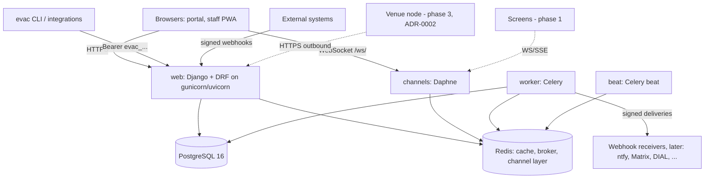
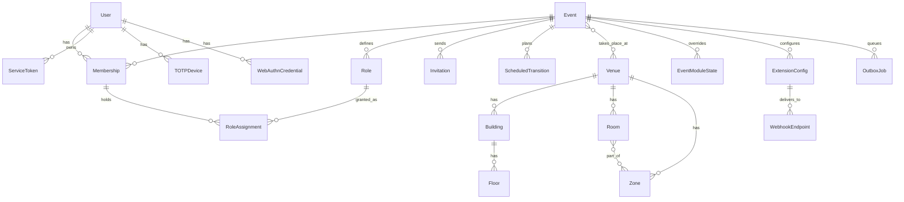

# Architecture

EVAC is one Django project (`evac/`) made of plugins (`apps/*`, `extensions/*`), deployed as one
container image in several roles. This document describes the phase 0 platform; it grows with every phase.
Decisions are recorded in [`adr/`](adr/).

## 1. Components

| Process | Responsibilities |
|---|---|
| `web` | portal pages, REST API, OpenAPI, SSE and long-poll, inbound webhooks, docs, health/metrics |
| `channels` | WebSocket consumers (`/ws/e/<slug>/`; screens and alarm delivery later) |
| `worker` | outbox delivery (`apps.core.tasks.deliver_job`), future media transcoding, imports |
| `beat` | `drain_outbox` 5 s, `apply_scheduled_transitions` 60 s, daily purges |

## 2. Data model (phase 0)

Plus `core.AuditLog` (hash-chained, ids instead of foreign keys), `core.AuditChainHead`,
`core.ModuleState` (instance), `core.SettingValue` (namespace × level × scope), `core.Notification`.

- **Tenancy**: the `Event` is the tenant root; event pages live under `/e/<slug>/`. Venues are shared
  between events (a permanent venue hosts many events).
- **Users** are global; per-event access comes only from memberships and role assignments. Instance admins
  are superusers.

## 3. Plugin model

See [PLUGIN_SDK.md](PLUGIN_SDK.md) and [ADR-0001](adr/0001-architecture-and-plugin-model.md). The registry
is loaded lazily from `<app>.evac_plugin` for every installed app; settings add third-party apps from the
`evac.plugins` entry point group. Module on/off state (instance + event) is evaluated per request
(`apps.core.modules`), with dependencies.

## 4. Security model

- **Authentication**: sessions (password + optional second factor, or OIDC) and service tokens.
- **Authorization**: `apps.events.permissions` (pure) evaluates grants built from role assignments:
  permission keys from role patterns, optional scope `(kind, id)` matched against the target's
  `evac_scope_chain()`, and two-factor gates (role `require_2fa`, permission `sensitive`).
  [ADR-0005](adr/0005-rbac-scopes-and-2fa.md)
- **Audit**: every service writes a hash-chained audit row ([ADR-0004](adr/0004-audit-hash-chain.md)).
- **Secrets**: Fernet-encrypted at rest ([ADR-0007](adr/0007-secrets-at-rest.md)).
- **Browser**: strict CSP (no inline scripts), CSRF, `X-Frame-Options: DENY`, rate limits.
- Threat model: [SECURITY.md](SECURITY.md).

## 5. Key flows

**Lifecycle change**: view/API → `Event.transition()` → audit row → `webhooks.emit("event.state_changed")`
→ webhook sinks enqueue outbox jobs (same transaction) → on commit the worker delivers signed POSTs;
→ `realtime.publish` → WebSocket group + SSE/poll buffer.

**Inbound webhook**: `POST /api/v1/extensions/<key>/<id>/webhook/` → config enabled? → HMAC verify →
idempotency by delivery id → `ExtensionSpec.handle_webhook` → log.

**Login with 2FA**: password (or OIDC) → if the user has a second factor: pending session → TOTP, recovery
code or WebAuthn → `login()` + session flag `evac_2fa_verified_at`.

## 6. Realtime

[ADR-0008](adr/0008-realtime-topology.md): WebSocket via Channels, SSE and long-poll fallbacks reading a
per-event ring buffer with sequence numbers.

## 7. Central service and venue node

Proposed in [ADR-0002](adr/0002-central-node-sync.md) (config snapshots with ETags central → node,
op-log with idempotency keys node → central, resumable asset sync) and
[ADR-0003](adr/0003-alarm-delivery-redundancy.md) (signed alarm messages, secondary node, hardware bridge).
`EVAC_MODE` (`central`/`node`) exists from phase 0; behaviour arrives in phase 3.
